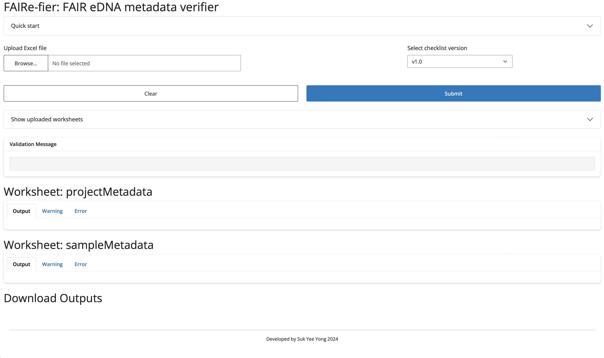

# FAIRe-fier: FAIR eDNA metadata verifier

FAIRe-fier is a Shiny for Python application for validating environmental DNA (eDNA) according to FAIR (Findable, Accessible, Interoperable, Reusable) principles.

<p align="center">
  <a href="https://shiny.csiro.au/FAIRe-fier/" target="_blank">
    
  </a>
</p>

<p align="center">
  
</p>


## Features
- Upload and preview Excel metadata worksheets
- Validate against versioned FAIR eDNA checklists
- Clear warnings and errors with colour-blind safe highlighted cells for revision
- Export cleaned validated metadata outputs


## Installation
```bash
# TODO update link
git clone https://github.com/csiro-internal/FAIRe-fier.git
cd FAIRe-fier
pip install -r requirements.txt
```


## Quick Start
1. Download the metadata checklist template (`FAIRe_checklist*.xlsx`) from the [FAIRe metadata checklist page](https://fair-edna.github.io/download.html#faire-metadata-checklist) and save it in this repository (or in the directory specified by `config_data.data_dir`).
2. Run the app locally:
    ```bash
    shiny run --reload app.py
    ```
    Then open the URL displayed in the terminal in a web browser to access the app.


## Usage

### Validation workflow
1. **Checklist selection**: loads rules for project/sample metadata
2. **Parse worksheets**: read uploaded Excel file
3. **Validate**: term presence, type, and cross-sheet checks
4. **Report**: warnings/errors with highlighted cells to revise
5. **Export**: download clean workbook and/or revise sheets

### Inputs
Upload a single Excel file (`.xlsx` or `.xls`) containing:
- `projectMetadata` or `projectMetadata_revise`: project-level metadata
- `sampleMetadata` or `sampleMetadata_revise`: sample-level metadata

Example input templates are available at: [FAIRe example datasets page](https://fair-edna.github.io/download.html#example-datasets)

### Outputs
- `fairefier_metadata.xlsx`: clean validated metadata when validation passes
- `fairefier_warn_error.xlsx`: revision sheets with warnings/errors


## Citation
If you use the software, please cite:
> Yong, SukYee (2026): FAIRe-fier. CSIRO. v1. Software. http://hdl.handle.net/102.100.100/734538

If you use the hosted web application, cite:
> Yong, SukYee; & Takahashi, Miwa (2025): FAIRe-fier: FAIR eDNA metadata verifier. v2. CSIRO. Service Collection. http://hdl.handle.net/102.100.100/706519


## Acknowledgements
- Colour-blind safe palettes: <https://sronpersonalpages.nl/~pault/>


## Author
Suk Yee Yong (sukyee.yong@csiro.au)  
